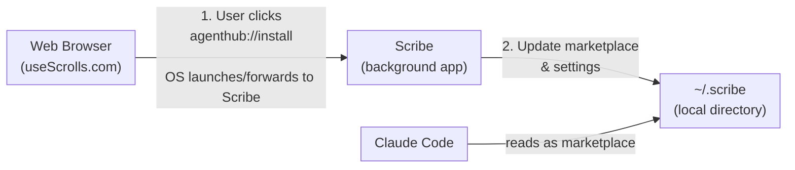

# Scribe

A local service that enables one-click plugin installation from [useScrolls](https://usescrolls.com) into Claude Code.

## Overview

Scribe is a lightweight local service that bridges the gap between the useScrolls web marketplace and Claude Code's plugin system. It manages a directory-based marketplace that Claude Code reads directly from the filesystem.

### Architecture



### Key Concepts

- **Directory-Based Marketplace**: Unlike URL-based marketplaces, directory marketplaces support all source types including relative paths
- **Pass-Through Sources**: GitHub, npm, and git URL sources are passed directly to Claude Code
- **Zip Sources**: Downloaded and extracted locally, enabling offline access

## Quick Start

Download the DMG from [usescrolls.com/releases](https://usescrolls.com/releases), open it, and drag Scribe to your Applications folder.

For other platforms and installation methods, see [Installation](docs/installation.md).

## First-Time Setup

After starting Scribe, add the marketplace to Claude Code:

```shell
# In Claude Code
/plugin marketplace add ~/.scribe
```

Or Scribe will auto-configure `~/.claude/settings.json` on first plugin install.

## How It Works

Scribe uses the `agenthub://` URL scheme for one-click installs:

1. Click an `agenthub://install?...` link on the website
2. OS launches Scribe with the URL
3. If Scribe is already running, the URL is forwarded via IPC
4. Scribe resolves the source (downloads if zip, passes through otherwise)
5. Scribe updates `~/.scribe/.claude-plugin/marketplace.json`
6. Scribe updates `~/.claude/settings.json` to enable the plugin
7. Run `/plugin` in Claude Code to complete installation

**URL format:** `agenthub://install?name=plugin-name&source=github&repo=owner/repo`

## CLI Usage

Scribe also provides a command-line interface for managing plugins:

```bash
# Install plugins
scribe install prettier --github usescrolls/prettier-skill
scribe install eslint --npm @anthropic/claude-eslint
scribe install tool --zip https://example.com/plugin.zip

# List installed plugins
scribe list
scribe list --json
scribe list --names-only

# Show plugin details
scribe info prettier

# Uninstall plugins
scribe uninstall prettier
scribe uninstall --all

# Show version
scribe version
```

For complete CLI documentation, see [CLI Specification](docs/cli-spec.md).

## Documentation

- [Installation](docs/installation.md) - All installation methods, CLI usage, and background service setup
- [CLI Specification](docs/cli-spec.md) - Complete CLI command reference
- [Configuration](docs/configuration.md) - Source types, data storage, and settings
- [Troubleshooting](docs/troubleshooting.md) - Common issues and solutions
- [Development](docs/development.md) - Building, testing, and architecture reference

## License

MIT
