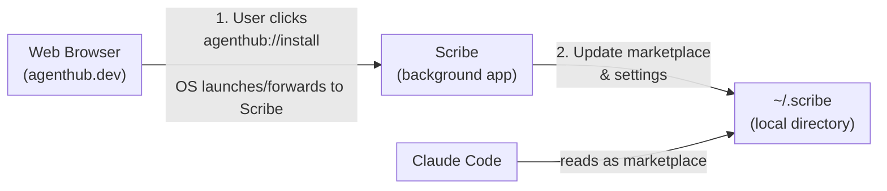
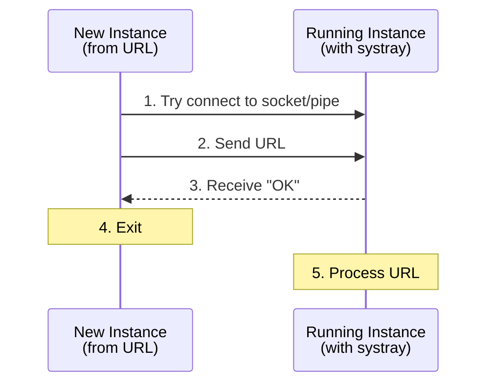

# Scribe

A local service that enables one-click plugin installation from [AgentHub](https://agenthub.dev) into Claude Code.

## Overview

Scribe is a lightweight local service that bridges the gap between the AgentHub web marketplace and Claude Code's plugin system. It manages a directory-based marketplace that Claude Code reads directly from the filesystem.

### Architecture



### Key Concepts

- **Directory-Based Marketplace**: Unlike URL-based marketplaces, directory marketplaces support all source types including relative paths
- **Pass-Through Sources**: GitHub, npm, and git URL sources are passed directly to Claude Code
- **Zip Sources**: Downloaded and extracted locally, enabling offline access

## Installation

### Option 1: macOS DMG Installer (Recommended)

Download the DMG from [agenthub.dev/releases](https://agenthub.dev/releases), open it, and drag Scribe to your Applications folder.

### Option 2: Download Binary

```bash
# macOS (Apple Silicon)
curl -fsSL https://agenthub.dev/releases/scribe-darwin-arm64 -o scribe
chmod +x scribe
./scribe

# macOS (Intel)
curl -fsSL https://agenthub.dev/releases/scribe-darwin-amd64 -o scribe
chmod +x scribe
./scribe

# Linux
curl -fsSL https://agenthub.dev/releases/scribe-linux-amd64 -o scribe
chmod +x scribe
./scribe

# Windows (PowerShell)
Invoke-WebRequest -Uri https://agenthub.dev/releases/scribe-windows-amd64.exe -OutFile scribe.exe
.\scribe.exe
```

### Option 3: Windows PowerShell Installer

For Windows, use the PowerShell installer script for full setup including URL scheme registration:

```powershell
# Download the binary and installer
Invoke-WebRequest -Uri https://agenthub.dev/releases/scribe-windows-amd64.exe -OutFile scribe.exe
Invoke-WebRequest -Uri https://agenthub.dev/releases/install.ps1 -OutFile install.ps1

# System-wide install (requires admin)
.\install.ps1

# Or user-only install (no admin required)
.\install.ps1 -UserInstall
```

The installer:
- Copies the binary to `Program Files\Scribe` (or `%LOCALAPPDATA%\Scribe` for user install)
- Registers the `agenthub://` URL scheme in the Windows Registry
- Optionally creates a startup shortcut

### Option 4: Build from Source

```bash
# Clone the repo
git clone https://github.com/usescrolls/scribe.git
cd scribe

# Requires Go 1.21+
make deps
make build
./build/scribe

# For Windows cross-compilation from macOS/Linux:
make install-windows
```

### Option 5: Run with Go

```bash
go run ./cmd/scribe
```

## First-Time Setup

After starting Scribe, add the marketplace to Claude Code:

```shell
# In Claude Code
/plugin marketplace add ~/.scribe
```

Or Scribe will auto-configure `~/.claude/settings.json` on first plugin install.

## Installation Flow

Scribe uses the `agenthub://` URL scheme for one-click installs:

1. Click an `agenthub://install?...` link on the website
2. OS launches Scribe with the URL
3. If Scribe is already running, the URL is forwarded via IPC
4. Scribe resolves the source (downloads if zip, passes through otherwise)
5. Scribe updates `~/.scribe/.claude-plugin/marketplace.json`
6. Scribe updates `~/.claude/settings.json` to enable the plugin
7. Run `/plugin` in Claude Code to complete installation

**URL format:** `agenthub://install?name=plugin-name&source=github&repo=owner/repo`

| Platform | URL Scheme Registration | IPC Mechanism |
|----------|------------------------|---------------|
| macOS | Info.plist (app bundle) | Apple Events |
| Linux | XDG desktop entry | Unix domain socket |
| Windows | Registry | Named mutex + named pipe |

## Source Types

| Source | Example | Scribe Handling |
|--------|---------|---------------------|
| GitHub | `{"source": "github", "repo": "owner/repo"}` | Pass-through (Claude Code handles) |
| npm | `{"source": "npm", "package": "package-name"}` | Pass-through (Claude Code handles) |
| Git URL | `{"source": "url", "url": "https://github.com/..."}` | Pass-through (Claude Code handles) |
| Zip | `{"source": "zip", "url": "https://example.com/plugin.zip"}` | Downloaded & extracted locally |

For `zip` sources (recommended for website distribution), Scribe:
1. Downloads the zip file from the URL
2. Extracts it to `~/.scribe/plugins/<name>/`
3. Writes a relative path entry (`"./plugins/<name>"`) to `marketplace.json`

For `github`, `npm`, and `url` sources, Scribe passes them through to `marketplace.json` as-is, and Claude Code handles the actual download/installation.

## Data Storage

Data is stored in the user's home directory:
- **macOS/Linux:** `~/.scribe/`
- **Windows:** `%USERPROFILE%\.scribe\`

```
~/.scribe/
├── .claude-plugin/
│   └── marketplace.json      # Claude Code reads this directly
├── plugins/                  # Downloaded plugin files (for zip sources)
│   └── <plugin-name>/
│       ├── .claude-plugin/
│       │   └── plugin.json
│       ├── commands/
│       ├── agents/
│       └── skills/
└── data/
    └── registry.json         # Scribe's internal state
```

- **Marketplace**: `~/.scribe/.claude-plugin/marketplace.json` - Generated by Scribe, read by Claude Code
- **Plugin Registry**: `~/.scribe/data/registry.json` - Tracks installed plugins with original and resolved sources
- **Downloaded Plugins**: `~/.scribe/plugins/` - Extracted plugin files for `zip` sources
- **Claude Code Settings**: `~/.claude/settings.json` - Updated to enable plugins and register marketplace

### Registry vs Marketplace: Why Two Files?

Scribe maintains two separate data files that serve different purposes:

| Aspect | `registry.json` | `marketplace.json` |
|--------|-----------------|-------------------|
| **Location** | `data/registry.json` | `.claude-plugin/marketplace.json` |
| **Consumer** | Scribe only | Claude Code only |
| **Purpose** | Internal state tracking | Plugin catalog for Claude Code |
| **Contains** | Original + resolved sources, timestamps | Only resolved sources |

**Why the separation?**

1. **Source Resolution**: The registry preserves the original source URL (e.g., `https://agenthub.dev/plugins/test-runner.zip`) while the marketplace contains the resolved local path (e.g., `./plugins/test-runner`). This allows Scribe to re-download or update plugins later.

2. **Metadata**: The registry stores installation timestamps and other internal metadata that Claude Code doesn't need.

3. **Clean Interface**: Claude Code gets a simple, minimal file with just what it needs to load plugins.

**Example transformation:**

```json
// registry.json stores the full context:
{
  "name": "test-runner",
  "source": {
    "source": "zip",
    "url": "https://agenthub.dev/plugins/test-runner.zip"
  },
  "resolvedSource": "./plugins/test-runner",
  "installedAt": "2025-01-15T10:30:00Z",
  "version": "1.5.0"
}

// marketplace.json gets the minimal resolved version:
{
  "name": "test-runner",
  "source": "./plugins/test-runner",
  "version": "1.5.0"
}
```

For pass-through sources (GitHub, npm, git URL), both files contain similar source definitions since no local resolution is needed.

## Running as a Background Service

### macOS (launchd)

```bash
# Create launch agent
cat > ~/Library/LaunchAgents/dev.scribe.plist << 'EOF'
<?xml version="1.0" encoding="UTF-8"?>
<!DOCTYPE plist PUBLIC "-//Apple//DTD PLIST 1.0//EN" "http://www.apple.com/DTDs/PropertyList-1.0.dtd">
<plist version="1.0">
<dict>
    <key>Label</key>
    <string>dev.scribe</string>
    <key>ProgramArguments</key>
    <array>
        <string>/Users/YOU/.local/bin/scribe</string>
    </array>
    <key>RunAtLoad</key>
    <true/>
    <key>KeepAlive</key>
    <true/>
    <key>StandardOutPath</key>
    <string>/tmp/scribe.log</string>
    <key>StandardErrorPath</key>
    <string>/tmp/scribe.log</string>
</dict>
</plist>
EOF

# Load the service
launchctl load ~/Library/LaunchAgents/dev.scribe.plist
```

### Linux (systemd)

```bash
# Create user service
mkdir -p ~/.config/systemd/user

cat > ~/.config/systemd/user/scribe.service << 'EOF'
[Unit]
Description=Scribe
After=network.target

[Service]
ExecStart=%h/.local/bin/scribe
Restart=always
RestartSec=5

[Install]
WantedBy=default.target
EOF

# Enable and start
systemctl --user daemon-reload
systemctl --user enable scribe
systemctl --user start scribe
```

### Windows (Startup Folder)

The PowerShell installer can create a startup shortcut automatically. To do it manually:

```powershell
# Create a shortcut in the Startup folder
$WshShell = New-Object -ComObject WScript.Shell
$Shortcut = $WshShell.CreateShortcut("$env:APPDATA\Microsoft\Windows\Start Menu\Programs\Startup\Scribe.lnk")
$Shortcut.TargetPath = "$env:ProgramFiles\Scribe\scribe.exe"
$Shortcut.Save()
```

Or use Task Scheduler for more control:

```powershell
# Create a scheduled task to run at login
$Action = New-ScheduledTaskAction -Execute "$env:ProgramFiles\Scribe\scribe.exe"
$Trigger = New-ScheduledTaskTrigger -AtLogon
$Settings = New-ScheduledTaskSettingsSet -AllowStartIfOnBatteries -DontStopIfGoingOnBatteries
Register-ScheduledTask -TaskName "Scribe" -Action $Action -Trigger $Trigger -Settings $Settings
```

## Command Line Options

```bash
./scribe [options]

Options:
  -no-gui        Run without system tray icon (headless mode)
  -debug         Enable debug logging
```

## System Tray

When running with GUI (default), Scribe shows a system tray icon with:

- **Status**: Shows version and running state
- **Plugins**: Shows count of installed plugins
- **Delete Local Data**: Uninstalls all plugins, clears settings, and deletes data
- **Quit**: Stops Scribe

## Security

- **URL Scheme**: Plugin installation uses `agenthub://` URLs, avoiding browser mixed-content restrictions
- **IPC Security**: Linux socket uses `0600` permissions; Windows pipe uses current user security

## Development

```bash
# Run with hot reload (requires air)
air

# Run tests
go test ./...

# Build for all platforms
make build-all
```

## Building the macOS DMG Installer

```bash
# Prerequisites
brew install create-dmg

# Build the DMG (requires a binary in build/)
make app    # Creates Scribe.app bundle
make dmg    # Creates Scribe-Installer.dmg

# Or build everything at once
make release
```

The DMG will be created at `build/Scribe-Installer.dmg`.

**Note:** Building the DMG requires granting Finder automation permissions to your terminal app (System Settings > Privacy & Security > Automation).

## Troubleshooting

### Scribe Not Starting

**macOS/Linux:**
1. Check logs: `/tmp/scribe.log`
2. Try running with debug: `./scribe -debug`

**Windows:**
1. Try running with debug: `.\scribe.exe -debug`
2. Check Windows Event Viewer for application errors

### Plugins Not Appearing in Claude Code

1. Verify marketplace is registered: Check `~/.claude/settings.json` for `extraKnownMarketplaces.agenthub`
2. Verify marketplace.json exists: `cat ~/.scribe/.claude-plugin/marketplace.json`
3. Run `/plugin` in Claude Code to refresh

### URL Scheme Not Working (agenthub:// links)

**macOS:**
- URL scheme is registered via Info.plist in the app bundle
- Ensure you're running the .app bundle, not the raw binary

**Linux:**
- Check desktop entry exists: `cat ~/.local/share/applications/agenthub.desktop`
- Re-register: `xdg-mime default agenthub.desktop x-scheme-handler/agenthub`
- Update database: `update-desktop-database ~/.local/share/applications/`

**Windows:**
- Verify registry entry: `reg query HKCR\agenthub`
- Re-run the installer: `.\install.ps1` or `.\install.ps1 -UserInstall`
- Check that the binary path in the registry matches the actual install location

---

## Architecture (Developer Reference)

This section covers internal implementation details for developers working on Scribe.

### URL Scheme IPC Architecture

When a user clicks an `agenthub://` link, the OS behavior differs by platform:

| Platform | App Not Running | App Already Running |
|----------|-----------------|---------------------|
| macOS | Launches app with URL as CLI arg | Sends `kAEGetURL` Apple Event |
| Linux | Launches new process with URL arg | Must forward via IPC (new process starts) |
| Windows | Launches new process with URL arg | Must forward via IPC (new process starts) |

**Key insight:** macOS handles "already running" natively via Apple Events. Linux and Windows always launch a new process, so we must implement single-instance detection and IPC ourselves.

### IPC Flow (Linux/Windows)



### Source Files

```
cmd/scribe/
├── main.go                 # Main logic, URL scheme processing
├── url_handler.go          # Shared IPC interface (function pointers)
├── url_handler_darwin.go   # macOS: Apple Events via Objective-C/CGO
├── url_handler_darwin.m    # Objective-C Apple Event handler
├── url_handler_linux.go    # Linux: Unix domain socket IPC
├── url_handler_windows.go  # Windows: Named mutex + named pipe IPC
└── url_handler_other.go    # Fallback stub for unsupported platforms
```

### Build Tags

| File | Build Tag | Purpose |
|------|-----------|---------|
| `url_handler.go` | None (all platforms) | Shared interface |
| `url_handler_darwin.go` | `//go:build darwin` | macOS Apple Events |
| `url_handler_linux.go` | `//go:build linux` | Unix socket IPC |
| `url_handler_windows.go` | `//go:build windows` | Named pipe IPC |
| `url_handler_other.go` | `//go:build !darwin && !linux && !windows` | Fallback stub |

### IPC Protocol

Simple newline-delimited text with acknowledgment:

```
Client → Server: agenthub://install?name=test&source=github&repo=user/repo\n
Server → Client: OK\n
```

**Timeouts:**
- Connection: 2 seconds
- Read/write: 5 seconds

**Security:**
- Linux socket permissions: `0600` (owner only)
- Windows named pipe: Default security (current user)

### Platform-Specific Details

#### macOS

- URL scheme registered via `Info.plist` in the `.app` bundle
- Apple Events handled by Objective-C code (`url_handler_darwin.m`)
- CGO required for Cocoa/Objective-C integration
- Must run as `.app` bundle for URL scheme to work (not raw binary)

#### Linux

- URL scheme registered via XDG desktop entry (`~/.local/share/applications/agenthub.desktop`)
- IPC via Unix domain socket at `~/.scribe/ipc.sock`
- CGO required for GTK3 systray bindings
- Must run `update-desktop-database` after installing desktop entry

#### Windows

- URL scheme registered in Windows Registry (`HKEY_CLASSES_ROOT\agenthub`)
- Single-instance detection via named mutex (`Global\Scribe`)
- IPC via named pipe (`\\.\pipe\Scribe`)
- No CGO required for IPC (uses `go-winio` library)
- Requires admin for system-wide install, or use `-UserInstall` for user-only

### Cross-Compilation

The `systray` library requires CGO on all platforms, which complicates cross-compilation:

```bash
# This works (same platform):
go build ./cmd/scribe

# This fails (cross-platform with CGO):
GOOS=linux GOARCH=amd64 CGO_ENABLED=1 go build ./cmd/scribe
```

**Solution:** Build inside Docker or on the target platform:

```bash
# Linux: Build in Docker
make docker-build

# Windows: Build on Windows or use CI
make install-windows  # Cross-compiles, but test on real Windows
```

### Testing IPC

#### macOS
```bash
# Terminal 1: Start Scribe
./build/scribe -debug

# Terminal 2: Test URL scheme
open "agenthub://install?name=test&source=github&repo=user/repo"

# Verify
cat ~/.scribe/data/registry.json
```

#### Linux
```bash
# Use Docker test
make docker-test

# Or manually:
./build/scribe -debug &
xdg-open "agenthub://install?name=test&source=github&repo=user/repo"
```

#### Windows
```powershell
# Terminal 1: Start Scribe
.\scribe.exe -debug

# Terminal 2: Test URL scheme
Start-Process "agenthub://install?name=test&source=github&repo=user/repo"

# Verify
type $env:USERPROFILE\.scribe\data\registry.json
```

### Common Pitfalls

| Platform | Issue | Solution |
|----------|-------|----------|
| Linux | Stale socket file | Remove on startup (`os.Remove(socketPath)`) |
| Linux | Desktop database not updated | Run `update-desktop-database` |
| Windows | Pipe naming | Must use `\\.\pipe\` prefix |
| Windows | Registry permissions | Use `-UserInstall` or run as admin |
| All | Race condition on startup | Add connection timeout, retry logic |
| All | IPC server not started in headless mode | Call `RegisterURLSchemeHandler()` in `-no-gui` path |

## License

MIT
