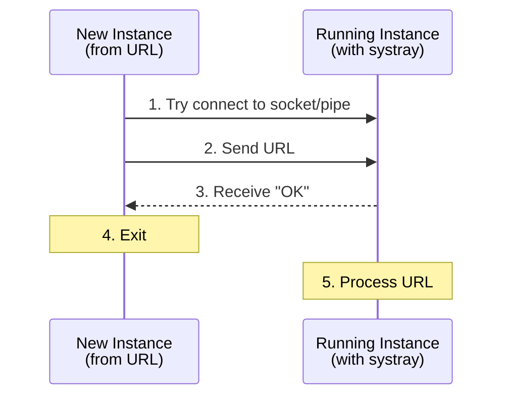

# Development

This guide covers building, testing, and contributing to Scribe.

## Prerequisites

**Go 1.26+**

```bash
# macOS
brew install go

# Linux / WSL
curl -LO https://go.dev/dl/go1.26.0.linux-amd64.tar.gz
sudo tar -C /usr/local -xzf go1.26.0.linux-amd64.tar.gz
export PATH=$PATH:/usr/local/go/bin:$HOME/go/bin
```

**Node.js 20+ and pnpm 10.30.0+**

```bash
# macOS
brew install node pnpm

# Linux / WSL
curl -fsSL https://deb.nodesource.com/setup_20.x | sudo bash -
sudo apt install -y nodejs
npm install -g pnpm
```

**Linux only — native dependencies**

```bash
# Debian/Ubuntu
sudo apt install libgtk-3-dev libwebkit2gtk-4.1-dev libayatana-appindicator3-dev pkg-config
```

## Quick Start

```bash
# Install Go and frontend dependencies
make deps

# Build the macOS .app bundle (includes frontend + Go binary)
make app

# Launch the app
make app-run
```

---

## Project Structure

```
scribe/
├── main.go                     # Entry point — dual-mode (CLI + GUI)
├── internal/                   # Core business logic
│   ├── types.go                # All core data structures
│   ├── agents.go               # 39 agent definitions with detection
│   ├── skills.go               # Skill discovery, listing, querying
│   ├── installer.go            # Symlink-based installation
│   ├── workspace.go            # Workspace CRUD and switching
│   ├── storage.go              # Persistent storage (JSON-based)
│   ├── meta.go                 # Sidecar .scribe-meta.json management
│   ├── naming.go               # Skill naming conventions
│   ├── source.go               # Source string parsing (GitHub, GitLab, etc.)
│   ├── fetch.go                # Git clone, source fetching, ZIP extraction
│   ├── gitauth.go              # Git authentication (SSH, HTTPS, credentials)
│   ├── gitcache.go             # Git clone/fetch caching
│   ├── marketplace.go          # Marketplace interface
│   ├── marketplace_github.go   # GitHub marketplace search
│   ├── onboarding.go           # Onboarding wizard logic
│   ├── system_skill.go         # Built-in agent detection skill
│   ├── url_scheme.go           # agenthub:// URL scheme handler
│   ├── update_checker.go       # Check for skill updates
│   ├── update_config.go        # Update configuration
│   ├── updater.go              # Perform skill updates
│   ├── self_update.go          # Self-update (binary upgrade)
│   ├── config.go               # Logger initialization
│   ├── logwriter.go            # Rotating log writer
│   └── *_test.go               # Unit tests (per-file)
├── cli/                        # CLI commands (Cobra)
│   ├── root.go                 # Root command, global flags (--debug, --json, --quiet)
│   ├── install.go              # scribe install
│   ├── uninstall.go            # scribe uninstall (aliases: remove, rm)
│   ├── list.go                 # scribe list (alias: ls)
│   ├── info.go                 # scribe info
│   ├── check.go                # scribe check
│   ├── update.go               # scribe update
│   ├── upgrade.go              # scribe upgrade (alias for update)
│   ├── version.go              # scribe version
│   ├── workspace.go            # scribe workspace subcommands
│   ├── cache.go                # scribe cache subcommands
│   ├── onboarding.go           # First-run onboarding flow
│   ├── prompt.go               # Interactive prompts and user input
│   ├── format.go               # Output formatting (tables, JSON)
│   ├── exitcodes.go            # Exit code constants
│   └── *_test.go               # CLI tests (per-file)
├── frontend/                   # Vue 3 + TypeScript + Tailwind CSS
│   ├── src/
│   │   ├── main.ts             # Vue app entry with Wails runtime
│   │   ├── App.vue             # Main layout with onboarding gate
│   │   ├── components/
│   │   │   ├── SkillList.vue              # Workspace skills list
│   │   │   ├── SkillCard.vue              # Skill display card
│   │   │   ├── SkillDetailModal.vue       # Skill detail modal
│   │   │   ├── BrowseSkills.vue           # All skills browser
│   │   │   ├── MarketplaceSkills.vue      # GitHub marketplace browser
│   │   │   ├── InstallSkills.vue          # Multi-step install wizard
│   │   │   ├── SidebarWorkspaceList.vue   # Workspace list in sidebar
│   │   │   ├── WorkspaceSelector.vue      # Workspace selector
│   │   │   ├── WorkspaceDropdown.vue      # Workspace dropdown menu
│   │   │   ├── WorkspaceSwitchInfoModal.vue # Workspace switch info
│   │   │   ├── AgentStatusPanel.vue       # Agent status display
│   │   │   ├── OnboardingWizard.vue       # First-run onboarding
│   │   │   ├── SettingsModal.vue          # Settings panel
│   │   │   ├── RepoReadmeModal.vue        # Repository README display
│   │   │   ├── ConfirmDialog.vue          # Confirmation dialogs
│   │   │   ├── ToastNotification.vue      # Notification system
│   │   │   ├── EmptyState.vue             # Empty state placeholder
│   │   │   ├── SourceAvatar.vue           # Source icon/avatar
│   │   │   └── onboarding/               # Onboarding step components
│   │   │       ├── WelcomeStep.vue
│   │   │       ├── AgentDetectionStep.vue
│   │   │       ├── ExistingSkillsStep.vue
│   │   │       ├── InstallDemoStep.vue
│   │   │       ├── TermsStep.vue
│   │   │       └── CompleteStep.vue
│   │   ├── composables/
│   │   │   ├── useSkills.ts
│   │   │   ├── useWorkspaces.ts
│   │   │   ├── useAgents.ts
│   │   │   ├── useOnboarding.ts
│   │   │   ├── useLogger.ts
│   │   │   ├── useUpdateChecker.ts
│   │   │   └── useSkillUpdateChecker.ts
│   │   ├── types/
│   │   │   └── skill.ts
│   │   └── bindings/
│   │       └── scribe.ts         # Auto-generated Wails bindings
│   └── **/*.test.ts              # Frontend tests (Vitest)
├── docs/                        # Documentation
├── packaging/                   # Platform installers
│   ├── macos/                   # create-app.sh, create-dmg.sh, Info.plist
│   ├── linux/                   # scribe.desktop
│   └── windows/                 # install.ps1, uninstall.ps1, agenthub.reg
├── scripts/
│   ├── install.sh               # Universal installer (macOS, Linux, WSL)
│   ├── uninstall.sh             # Universal uninstaller
│   └── hooks/                   # Git hooks (pre-commit, commit-msg)
├── icons/                       # App icons (SVG, PNG, ICO, ICNS)
├── assets/                      # Badge assets for documentation
├── .github/workflows/           # CI/CD (release.yml)
└── build/                       # Build outputs (generated)
```

---

## Testing

### Go Tests

```bash
# Run all tests
make test

# Run tests with verbose output
make test-verbose

# Run tests with coverage
make coverage

# Generate HTML coverage report
make coverage-html
open build/coverage.html
```

### Frontend Tests

```bash
cd frontend

# Run Vitest tests
pnpm test

# Run tests once (no watch)
pnpm test:run

# Run with coverage
pnpm test:coverage
```

---

## Building

### Development Build

```bash
# Run with Wails dev server (hot reload)
make dev
```

### Production Build

```bash
# Build binary for current platform
make build

# Build macOS .app bundle
make app

# Launch the .app bundle
make app-run

# Build and install to ~/.local/bin
make install
```

### Makefile Targets

| Target | Description |
|--------|-------------|
| `deps` | Install wails3, download Go modules, install frontend packages |
| `build` | Build frontend + Go binary for current platform |
| `build-frontend` | Build Vue frontend only (generates bindings if missing) |
| `dev` | Development mode with hot reload (`wails3 dev`) |
| `run` | Quick test: `go run . list` |
| `clean` | Remove build artifacts, node_modules, coverage |
| `install` | Build and install to `~/.local/bin` |
| `app` | Create macOS `.app` bundle (runs `build` first) |
| `app-run` | Launch the `.app` bundle |
| `test` | Run Go tests |
| `test-verbose` | Run Go tests with verbose output |
| `coverage` | Run tests with coverage stats |
| `coverage-html` | Generate HTML coverage report |
| `lint` | Run `golangci-lint` |
| `lint-fix` | Run `golangci-lint` with auto-fixes |
| `wails-generate` | Force regenerate Wails v3 bindings |
| `wails-ensure-bindings` | Generate bindings only if missing |
| `install-hooks` | Install pre-commit and commit-msg git hooks |

---

## Architecture Reference

### Core Types

```go
type Skill struct {
    Name        string         `json:"name"`
    Description string         `json:"description"`
    Path        string         `json:"path,omitempty"`
    Content     string         `json:"content,omitempty"`
    Metadata    map[string]any `json:"metadata,omitempty"`
    Meta        *SkillMeta     `json:"meta,omitempty"`
}

type SkillMeta struct {
    Source      string `json:"source"`
    SourceType  string `json:"sourceType"`
    SourceURL   string `json:"sourceUrl,omitempty"`
    SkillPath   string `json:"skillPath,omitempty"`
    ContentHash string `json:"contentHash"`
    CommitHash  string `json:"commitHash,omitempty"`
    CommitDate  string `json:"commitDate,omitempty"`
    IsPrivate   bool   `json:"isPrivate,omitempty"`
    InstalledAt string `json:"installedAt"`
    UpdatedAt   string `json:"updatedAt"`
}

type Agent struct {
    ID              string `json:"id"`
    DisplayName     string `json:"displayName"`
    GlobalSkillsDir string `json:"globalSkillsDir"`
    GlobalConfigDir string `json:"globalConfigDir"`
}

type Workspace struct {
    Name        string   `json:"name"`
    Description string   `json:"description,omitempty"`
    Skills      []string `json:"skills"`
}

type SourceInfo struct {
    Type      string // github, gitlab, bitbucket, git, local, url, well-known, zip
    Owner     string
    Repo      string
    Ref       string
    Subpath   string
    URL       string
    LocalPath string
}

type Config struct {
    ActiveWorkspace             string `json:"activeWorkspace"`
    OnboardingCompleted         bool   `json:"onboardingCompleted"`
    TermsAcceptedAt             string `json:"termsAcceptedAt,omitempty"`
    TermsAcceptedVersion        int    `json:"termsAcceptedVersion,omitempty"`
    UpdateNotificationsDisabled bool   `json:"updateNotificationsDisabled,omitempty"`
    LastUpdateCheck             string `json:"lastUpdateCheck,omitempty"`
}
```

### URL Scheme IPC Architecture

When a user clicks an `agenthub://` link, the OS behavior differs by platform:

| Platform | App Not Running | App Already Running |
|----------|-----------------|---------------------|
| macOS | Launches app with URL as CLI arg | Sends `kAEGetURL` Apple Event |
| Linux | Launches new process with URL arg | Must forward via IPC (new process starts) |
| Windows | Launches new process with URL arg | Must forward via IPC (new process starts) |

### IPC Flow (Linux/Windows)



### IPC Protocol

Simple newline-delimited text with acknowledgment:

```
Client → Server: agenthub://install?source=github&repo=user/repo\n
Server → Client: OK\n
```

**Timeouts:**
- Connection: 2 seconds
- Read/write: 5 seconds

**Security:**
- Linux socket permissions: `0600` (owner only)
- Windows named pipe: Default security (current user)

---

## Platform-Specific Details

### macOS

- URL scheme registered via `Info.plist` in the `.app` bundle
- Apple Events handled by Objective-C code
- CGO required for Cocoa/Objective-C integration
- Must run as `.app` bundle for URL scheme to work (not raw binary)

### Linux

- URL scheme registered via XDG desktop entry (`~/.local/share/applications/scribe.desktop`)
- IPC via Unix domain socket at `~/.scribe/ipc.sock`
- CGO required for GTK3 systray bindings
- Must run `update-desktop-database` after installing desktop entry

### Windows

- URL scheme registered in Windows Registry (`HKEY_CLASSES_ROOT\agenthub`)
- Single-instance detection via named mutex (`Global\Scribe`)
- IPC via named pipe (`\\.\pipe\Scribe`)
- No CGO required for IPC (uses `go-winio` library)
- Requires admin for system-wide install, or use `-UserInstall` for user-only

---

## Cross-Compilation

The Wails framework requires building on the target platform for GUI applications:

```bash
# Build on macOS for macOS
make build

# Build on Linux for Linux
make build

# Build on Windows for Windows
make build
```

For CI/CD, use platform-specific runners or Docker containers.

---

## Testing IPC

### macOS
```bash
# Terminal 1: Start Scribe
./build/scribe -debug

# Terminal 2: Test URL scheme
open "agenthub://install?source=github&repo=user/repo"

# Verify
ls ~/.scribe/scrolls/
```

### Linux
```bash
./build/scribe -debug &
xdg-open "agenthub://install?source=github&repo=user/repo"
```

### Windows
```powershell
# Terminal 1: Start Scribe
.\scribe.exe -debug

# Terminal 2: Test URL scheme
Start-Process "agenthub://install?source=github&repo=user/repo"

# Verify
dir $env:USERPROFILE\.scribe\scrolls\
```

---

## Common Pitfalls

| Platform | Issue | Solution |
|----------|-------|----------|
| Linux | Stale socket file | Remove on startup (`os.Remove(socketPath)`) |
| Linux | Desktop database not updated | Run `update-desktop-database` |
| Windows | Pipe naming | Must use `\\.\pipe\` prefix |
| Windows | Registry permissions | Use `-UserInstall` or run as admin |
| All | Race condition on startup | Add connection timeout, retry logic |
| All | Symlink failures | Fall back to directory copy |
