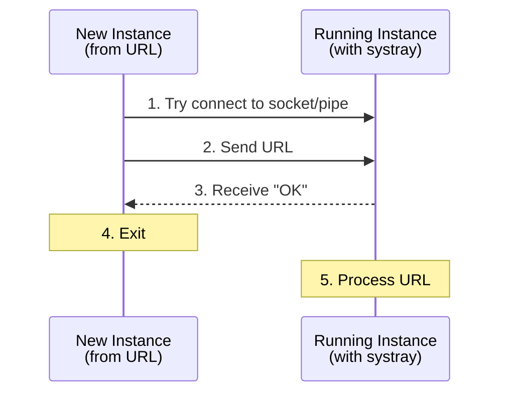

# Development

This guide covers building, testing, and contributing to Scribe.

## Quick Start

```bash
# Run with hot reload (requires air)
air

# Run tests
go test ./...

# Build for all platforms
make build-all
```

---

## Testing

### Local Testing

```bash
# Run all tests
go test ./...

# Run tests with verbose output
make test-verbose

# Run tests with coverage
make coverage

# Generate HTML coverage report
make coverage-html
```

### Docker Testing

Docker testing provides a consistent, isolated environment for running tests. This is useful for CI/CD pipelines and ensuring tests pass across different environments.

#### Quick Commands

```bash
# Run all tests in Docker
make docker-test

# Run tests with coverage report
make docker-test-coverage

# Run tests with race detector
make docker-test-race

# Run specific tests by pattern
make docker-test-filter TEST_PATTERN=TestSkill

# Clean Docker test artifacts
make docker-test-clean
```

#### Manual Docker Commands

```bash
# Build the test image
docker build -f test.Dockerfile -t scribe-test .

# Run tests
docker run --rm scribe-test

# Run with coverage output
docker run --rm -v $(pwd)/coverage:/coverage scribe-test \
  sh -c "go test -coverprofile=/coverage/coverage.out ./internal/... && \
         go tool cover -func=/coverage/coverage.out"

# Run specific test pattern
docker run --rm scribe-test go test -v -run "TestWorkspace" ./internal/...
```

#### Docker Compose

For more complex test scenarios, use `docker-compose.test.yml`:

```bash
# Run standard tests
docker-compose -f docker-compose.test.yml run --rm test

# Run with coverage
docker-compose -f docker-compose.test.yml run --rm test-coverage

# Run with race detector
docker-compose -f docker-compose.test.yml run --rm test-race

# Run filtered tests
TEST_PATTERN=TestInstall docker-compose -f docker-compose.test.yml run --rm test-filter
```

#### Test Coverage

Current test coverage is approximately **72.5%** for the internal package. Coverage reports can be generated in multiple formats:

```bash
# Terminal output
make docker-test-coverage

# HTML report (local)
make coverage-html
open build/coverage.html
```

---

## Building the macOS DMG Installer

```bash
# Prerequisites
brew install create-dmg

# Build the DMG (requires a binary in build/)
make app    # Creates Scribe.app bundle
make dmg    # Creates Scribe-Installer.dmg

# Or build everything at once
make release
```

The DMG will be created at `build/Scribe-Installer.dmg`.

**Note:** Building the DMG requires granting Finder automation permissions to your terminal app (System Settings > Privacy & Security > Automation).

---

## Architecture Reference

This section covers internal implementation details for developers working on Scribe.

### URL Scheme IPC Architecture

When a user clicks an `agenthub://` link, the OS behavior differs by platform:

| Platform | App Not Running | App Already Running |
|----------|-----------------|---------------------|
| macOS | Launches app with URL as CLI arg | Sends `kAEGetURL` Apple Event |
| Linux | Launches new process with URL arg | Must forward via IPC (new process starts) |
| Windows | Launches new process with URL arg | Must forward via IPC (new process starts) |

**Key insight:** macOS handles "already running" natively via Apple Events. Linux and Windows always launch a new process, so we must implement single-instance detection and IPC ourselves.

### IPC Flow (Linux/Windows)



### Source Files

```
internal/scribe/            # Core business logic (importable package)
├── config.go               # Constants, logger, embedded icon
├── types.go                # Data structures (Plugin, RegistryEntry, etc.)
├── server.go               # Server struct and constructor
├── registry.go             # Registry persistence (Load, Save, Migrate)
├── marketplace.go          # marketplace.json generation
├── source.go               # Source resolution and zip download
├── claude.go               # Claude Code settings management
├── plugins.go              # Plugin lifecycle (uninstall, reset)
├── url_scheme.go           # URL scheme parsing and handling
└── scribe_test.go          # Unit tests

cmd/scribe/                 # Entry point and platform-specific code
├── main.go                 # Entry point and startup logic
├── gui_cgo.go              # System tray UI (requires CGO)
├── gui_nocgo.go            # Headless fallback (CGO disabled)
├── url_handler.go          # Shared IPC interface (function pointers)
├── url_handler_darwin.go   # macOS: Apple Events via Objective-C/CGO
├── url_handler_darwin.m    # Objective-C Apple Event handler
├── url_handler_linux.go    # Linux: Unix domain socket IPC
├── url_handler_windows.go  # Windows: Named mutex + named pipe IPC
└── url_handler_other.go    # Fallback stub for unsupported platforms
```

### Build Tags

| File | Build Tag | Purpose |
|------|-----------|---------|
| `url_handler.go` | None (all platforms) | Shared interface |
| `url_handler_darwin.go` | `//go:build darwin` | macOS Apple Events |
| `url_handler_linux.go` | `//go:build linux` | Unix socket IPC |
| `url_handler_windows.go` | `//go:build windows` | Named pipe IPC |
| `url_handler_other.go` | `//go:build !darwin && !linux && !windows` | Fallback stub |

### IPC Protocol

Simple newline-delimited text with acknowledgment:

```
Client → Server: agenthub://install?name=test&source=github&repo=user/repo\n
Server → Client: OK\n
```

**Timeouts:**
- Connection: 2 seconds
- Read/write: 5 seconds

**Security:**
- Linux socket permissions: `0600` (owner only)
- Windows named pipe: Default security (current user)

---

## Platform-Specific Details

### macOS

- URL scheme registered via `Info.plist` in the `.app` bundle
- Apple Events handled by Objective-C code (`url_handler_darwin.m`)
- CGO required for Cocoa/Objective-C integration
- Must run as `.app` bundle for URL scheme to work (not raw binary)

### Linux

- URL scheme registered via XDG desktop entry (`~/.local/share/applications/scribe.desktop`)
- IPC via Unix domain socket at `~/.scribe/ipc.sock`
- CGO required for GTK3 systray bindings
- Must run `update-desktop-database` after installing desktop entry

### Windows

- URL scheme registered in Windows Registry (`HKEY_CLASSES_ROOT\agenthub`)
- Single-instance detection via named mutex (`Global\Scribe`)
- IPC via named pipe (`\\.\pipe\Scribe`)
- No CGO required for IPC (uses `go-winio` library)
- Requires admin for system-wide install, or use `-UserInstall` for user-only

---

## Cross-Compilation

The `systray` library requires CGO on all platforms, which complicates cross-compilation:

```bash
# This works (same platform):
go build ./cmd/scribe

# This fails (cross-platform with CGO):
GOOS=linux GOARCH=amd64 CGO_ENABLED=1 go build ./cmd/scribe
```

**Solution:** Build inside Docker or on the target platform:

```bash
# Linux: Build in Docker
make docker-build

# Windows: Build on Windows or use CI
make install-windows  # Cross-compiles, but test on real Windows
```

---

## Testing IPC

### macOS
```bash
# Terminal 1: Start Scribe
./build/scribe -debug

# Terminal 2: Test URL scheme
open "agenthub://install?name=test&source=github&repo=user/repo"

# Verify
cat ~/.scribe/data/registry.json
```

### Linux
```bash
# Use Docker test
make docker-test

# Or manually:
./build/scribe -debug &
xdg-open "agenthub://install?name=test&source=github&repo=user/repo"
```

### Windows
```powershell
# Terminal 1: Start Scribe
.\scribe.exe -debug

# Terminal 2: Test URL scheme
Start-Process "agenthub://install?name=test&source=github&repo=user/repo"

# Verify
type $env:USERPROFILE\.scribe\data\registry.json
```

---

## Common Pitfalls

| Platform | Issue | Solution |
|----------|-------|----------|
| Linux | Stale socket file | Remove on startup (`os.Remove(socketPath)`) |
| Linux | Desktop database not updated | Run `update-desktop-database` |
| Windows | Pipe naming | Must use `\\.\pipe\` prefix |
| Windows | Registry permissions | Use `-UserInstall` or run as admin |
| All | Race condition on startup | Add connection timeout, retry logic |
| All | IPC server not started in headless mode | Call `RegisterURLSchemeHandler()` in `-no-gui` path |
