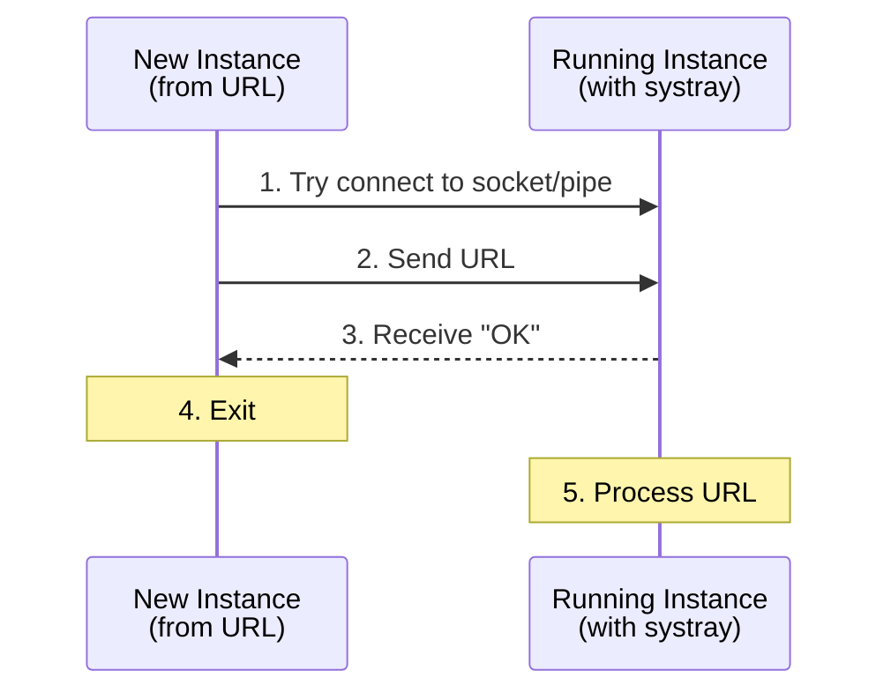

# Development

This guide covers building, testing, and contributing to Scribe.

## Quick Start

```bash
# Install dependencies
make deps

# Run in development mode with Wails
wails3 dev

# Run tests
go test ./...

# Build for all platforms
make build-all
```

---

## Project Structure

```
scribe/
├── main.go                     # Wails app entry, bindings
├── internal/                   # Core business logic
│   ├── types.go                # Data structures (Skill, Agent, Workspace)
│   ├── agents.go               # 45 agent definitions with detection
│   ├── skills.go               # SKILL.md parsing and discovery
│   ├── installer.go            # Symlink-based installation
│   ├── workspace.go            # Workspace CRUD and switching
│   ├── meta.go                 # Sidecar .scribe-meta.json management
│   ├── storage.go              # Canonical storage paths
│   ├── url_scheme.go           # agenthub:// URL scheme handler
│   └── skills_system_test.go   # Backend unit tests
├── cli/                        # CLI commands
│   ├── root.go                 # Root command setup
│   ├── install.go              # Install command
│   ├── uninstall.go            # Uninstall command
│   ├── list.go                 # List command
│   ├── info.go                 # Info command
│   ├── check.go                # Check for updates
│   ├── update.go               # Update skills
│   ├── workspace.go            # Workspace commands
│   └── cli_test.go             # CLI tests
├── frontend/                   # Vue 3 frontend
│   ├── src/
│   │   ├── App.vue             # Main layout with sidebar
│   │   ├── components/
│   │   │   ├── SkillList.vue
│   │   │   ├── SkillCard.vue
│   │   │   ├── WorkspaceSelector.vue
│   │   │   ├── AgentStatusPanel.vue
│   │   │   └── EmptyState.vue
│   │   ├── composables/
│   │   │   ├── useSkills.ts
│   │   │   ├── useWorkspaces.ts
│   │   │   └── useAgents.ts
│   │   └── types/
│   │       └── skill.ts
│   └── src/**/*.test.ts        # Frontend tests (Vitest)
├── docs/                       # Documentation
├── packaging/                  # Platform installers
└── build/                      # Build outputs
```

---

## Testing

### Local Testing

```bash
# Run all tests
go test ./...

# Run tests with verbose output
make test-verbose

# Run tests with coverage
make coverage

# Generate HTML coverage report
make coverage-html
```

### Docker Testing

Docker testing provides a consistent, isolated environment for running tests.

#### Quick Commands

```bash
# Run all tests in Docker
make docker-test

# Run tests with coverage report
make docker-test-coverage

# Run tests with race detector
make docker-test-race

# Run specific tests by pattern
make docker-test-filter TEST_PATTERN=TestSkill

# Clean Docker test artifacts
make docker-test-clean
```

#### Manual Docker Commands

```bash
# Build the test image
docker build -f test.Dockerfile -t scribe-test .

# Run tests
docker run --rm scribe-test

# Run with coverage output
docker run --rm -v $(pwd)/coverage:/coverage scribe-test \
  sh -c "go test -coverprofile=/coverage/coverage.out ./internal/... && \
         go tool cover -func=/coverage/coverage.out"

# Run specific test pattern
docker run --rm scribe-test go test -v -run "TestWorkspace" ./internal/...
```

#### Docker Compose

For more complex test scenarios, use `docker-compose.test.yml`:

```bash
# Run standard tests
docker-compose -f docker-compose.test.yml run --rm test

# Run with coverage
docker-compose -f docker-compose.test.yml run --rm test-coverage

# Run with race detector
docker-compose -f docker-compose.test.yml run --rm test-race

# Run filtered tests
TEST_PATTERN=TestInstall docker-compose -f docker-compose.test.yml run --rm test-filter
```

#### Test Coverage

Current test coverage is approximately **72.5%** for the internal package. Coverage reports can be generated in multiple formats:

```bash
# Terminal output
make docker-test-coverage

# HTML report (local)
make coverage-html
open build/coverage.html
```

### Frontend Testing

```bash
cd frontend

# Run Vitest tests
pnpm test

# Run with coverage
pnpm test:coverage

# Run in watch mode
pnpm test:watch
```

---

## Building

### Development Build

```bash
# Run with Wails dev server (hot reload)
wails3 dev

# Or build once
wails3 build
```

### Production Build

```bash
# Build for current platform
make build

# Build for all platforms
make build-all

# Build macOS DMG installer
make dmg
```

### Building the macOS DMG Installer

```bash
# Prerequisites
brew install create-dmg

# Build the DMG (requires a binary in build/)
make app    # Creates Scribe.app bundle
make dmg    # Creates Scribe-Installer.dmg

# Or build everything at once
make release
```

The DMG will be created at `build/Scribe-Installer.dmg`.

**Note:** Building the DMG requires granting Finder automation permissions to your terminal app (System Settings > Privacy & Security > Automation).

---

## Architecture Reference

### Core Types

```go
type Skill struct {
    Name        string
    Description string
    Path        string         // Local path to SKILL.md directory
    Content     string         // Raw SKILL.md content
    Metadata    map[string]any // Additional frontmatter fields
    Meta        *SkillMeta     // Source tracking (from .scribe-meta.json)
}

type SkillMeta struct {
    Source      string `json:"source"`
    SourceType  string `json:"sourceType"`
    SourceURL   string `json:"sourceUrl"`
    SkillPath   string `json:"skillPath,omitempty"`
    ContentHash string `json:"contentHash"`
    InstalledAt string `json:"installedAt"`
    UpdatedAt   string `json:"updatedAt"`
}

type Agent struct {
    ID              string
    DisplayName     string
    GlobalSkillsDir string // e.g., "~/.claude/skills"
    GlobalConfigDir string // For detection, e.g., "~/.claude"
}

type Workspace struct {
    Name        string   `json:"name"`
    Description string   `json:"description"`
    Skills      []string `json:"skills"`
}
```

### URL Scheme IPC Architecture

When a user clicks an `agenthub://` link, the OS behavior differs by platform:

| Platform | App Not Running | App Already Running |
|----------|-----------------|---------------------|
| macOS | Launches app with URL as CLI arg | Sends `kAEGetURL` Apple Event |
| Linux | Launches new process with URL arg | Must forward via IPC (new process starts) |
| Windows | Launches new process with URL arg | Must forward via IPC (new process starts) |

### IPC Flow (Linux/Windows)



### IPC Protocol

Simple newline-delimited text with acknowledgment:

```
Client → Server: agenthub://install?source=github&repo=user/repo\n
Server → Client: OK\n
```

**Timeouts:**
- Connection: 2 seconds
- Read/write: 5 seconds

**Security:**
- Linux socket permissions: `0600` (owner only)
- Windows named pipe: Default security (current user)

---

## Platform-Specific Details

### macOS

- URL scheme registered via `Info.plist` in the `.app` bundle
- Apple Events handled by Objective-C code
- CGO required for Cocoa/Objective-C integration
- Must run as `.app` bundle for URL scheme to work (not raw binary)

### Linux

- URL scheme registered via XDG desktop entry (`~/.local/share/applications/scribe.desktop`)
- IPC via Unix domain socket at `~/.scribe/ipc.sock`
- CGO required for GTK3 systray bindings
- Must run `update-desktop-database` after installing desktop entry

### Windows

- URL scheme registered in Windows Registry (`HKEY_CLASSES_ROOT\agenthub`)
- Single-instance detection via named mutex (`Global\Scribe`)
- IPC via named pipe (`\\.\pipe\Scribe`)
- No CGO required for IPC (uses `go-winio` library)
- Requires admin for system-wide install, or use `-UserInstall` for user-only

---

## Cross-Compilation

The Wails framework requires building on the target platform for GUI applications:

```bash
# Build on macOS for macOS
make build

# Build on Linux for Linux
make build

# Build on Windows for Windows
make build
```

For CI/CD, use platform-specific runners or Docker containers.

---

## Testing IPC

### macOS
```bash
# Terminal 1: Start Scribe
./build/scribe -debug

# Terminal 2: Test URL scheme
open "agenthub://install?source=github&repo=user/repo"

# Verify
ls ~/.scribe/scrolls/
```

### Linux
```bash
# Use Docker test
make docker-test

# Or manually:
./build/scribe -debug &
xdg-open "agenthub://install?source=github&repo=user/repo"
```

### Windows
```powershell
# Terminal 1: Start Scribe
.\scribe.exe -debug

# Terminal 2: Test URL scheme
Start-Process "agenthub://install?source=github&repo=user/repo"

# Verify
dir $env:USERPROFILE\.scribe\scrolls\
```

---

## Common Pitfalls

| Platform | Issue | Solution |
|----------|-------|----------|
| Linux | Stale socket file | Remove on startup (`os.Remove(socketPath)`) |
| Linux | Desktop database not updated | Run `update-desktop-database` |
| Windows | Pipe naming | Must use `\\.\pipe\` prefix |
| Windows | Registry permissions | Use `-UserInstall` or run as admin |
| All | Race condition on startup | Add connection timeout, retry logic |
| All | Symlink failures | Fall back to directory copy |
